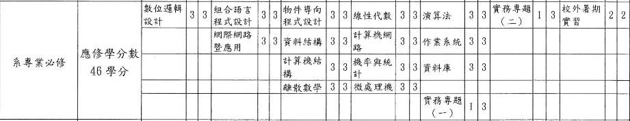

title: 資訊小抓週!?
output: index.html
progress: true

--
# 資訊技術大抓抓
## lemotw
--
### 資訊技術

--
# 我麼來roadmap一下
## https://blog.darkthread.net/Photos/2583-5a03-o.png
--
# C/C++ 有用嘛?
--
### 資工

--
### 怎麼辦我想學寫應用
* 網頁
* APP
* ...etc
--
### 網頁
* [你的roadmap](https://github.com/kamranahmedse/developer-roadmap)
* [好心の中文版](https://github.com/goodjack/developer-roadmap-chinese)
* [不然就是好玩的小網站](http://skill.phodal.com/)
* 更多資源盡在高科大資研社(?
--
### APP
* IOS
	* Swift
	* Object-C (?
* Android
	* Java (with android sdk
	* C++  (with android ndk
	* [kotlin](https://kotlinlang.org/)
--
# [Flutter](https://flutter.io)通吃喔~
## 是不是粉蚌，~~不過我是還不會啦~~
--
### 怎麼辦我想比較炫炮
* 人工智慧
* 物聯網
* ~~大樹鋸~~
* ...etc
--
# 兄ㄉㄞˇ數學粉重要
--
### 不過我數學也好爛

--
# 沒關係
--
# 我們有
--
### ~~全球最大工程師交友平台~~

--
# 不要急我懂你們想要交友的欲望
## 之後會有社課教啦~
--
# 基礎打穩
<h1 style="margin-top:10px;">力爭上游</h1>
## ~~相信會像蔣公一樣被寫進國文課本~~
---

# Any Question?

   

  

<h2 style="font-size: 18px">
本投影片採用<a href="http://creativecommons.org/licenses/by-sa/3.0/tw/" target="_blank">創用 CC「姓名標示—相同方式分享 3.0 台灣」授權條款</a>
</h2>
