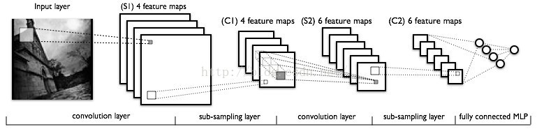

title: Neural Network with tensorflow
output: index.html
progress: true

--
# Neural Network with tensorflow
## lemotw
--
# Tensorflow
--
### 核心概念
* Tensor :在架構裡流動的資料形式
* Session :使用者與Tensorflow交流的窗口，可以透過session傳入資料，執行計算圖
* Variable :可以保留Tensor並用在計算的操作，計算時也會被更新
--
# <a href="http://yann.lecun.com/exdb/mnist/">MNIST</a>
--
# 讓我們用學過的神經網路來訓練吧~
--
# 一層Full Connect應該就夠了~
## Input Layer - [784 X 10]
--
# <a href="https://pastebin.com/n8cQMarL"> Code </a> 在這裡
--
### 細講
* 創造session: tf.InteractiveSession()
* 設定好輸入以及變數: tf.placeholder() tf.Variable()
* 設定好運算式: tf.nn.softmax(tf.matmul(x,w) + b)
* 設定error function: tf.reduce_mean(-tf.reduce_sum(y_ * tf.log(y), reduction_indices=[1]))
* 設定訓練演算法tf.train.GradientDescentOptimizer()
* 訓練
--
# LeNet-5 架構
--
### LeNet-5 看起來像這樣

--
### 捲積

--
### 池化

--
# <a href="https://pastebin.com/3YatigMt"> Code </a>
---

# Any Question?

   

  

<h2 style="font-size: 18px">
本投影片採用<a href="http://creativecommons.org/licenses/by-sa/3.0/tw/" target="_blank">創用 CC「姓名標示—相同方式分享 3.0 台灣」授權條款</a>
</h2>
