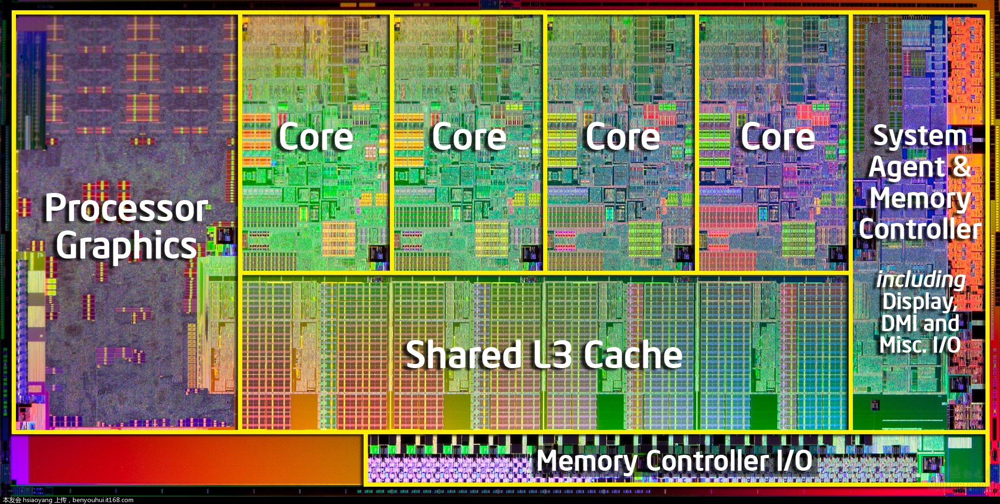
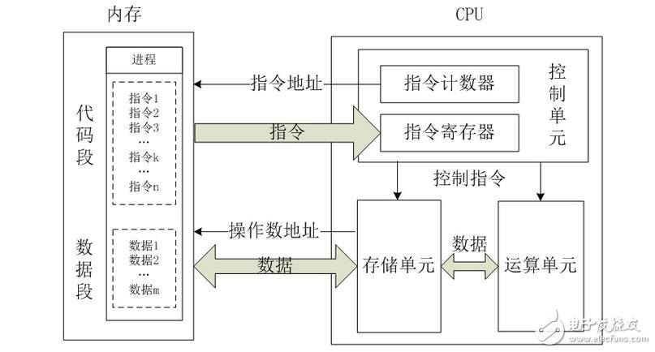
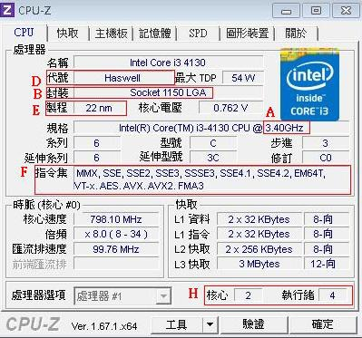
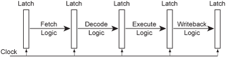
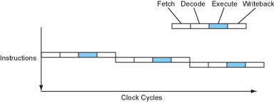
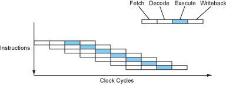
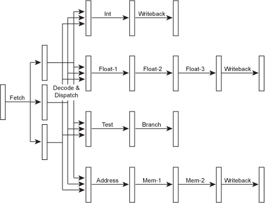
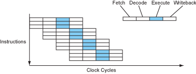

title: Quick Know what is CPU~
output: index.html
progress: true

--
# What is CPU?
## lemotw 
## ref:[現代處理器](http://www.lighterra.com/papers/modernmicroprocessors/)
--
# CPU (Central Processing Unit)
## 幫你算資料的東東，或是可以想成是大腦
--
# 我只是想寫程式，為什麼要學CPU
--
### CPU 

--
### CPU 架構

--

	

--
# CPI (Cycles per instruction)
--
### CPU如何執行一個指令
* Fetch(抓取程式碼)
* Decode(解碼)
* Execute(執行)
* Memory(記憶體存取)
* Write Back(寫回暫存器)
* Pipeline 把上面的工作切分開來(如下圖)
  

--

	<h2 style="font-weight:bold;">沒有Pipeline</h2>
	 
	

	<h2 style="font-weight:bold;">有Pipeline</h2>
	 
	

--
### SuperScalar

	

--
### SuperScalar performance

	

--
<iframe style="width:100%;height:80%;" src="per.html"></iframe>
--
# CPU logic in program
---
# Any Question?

   

  

<h2 style="font-size: 18px">
本投影片採用<a href="http://creativecommons.org/licenses/by-sa/3.0/tw/" target="_blank">創用 CC「姓名標示—相同方式分享 3.0 台灣」授權條款</a>
</h2>
