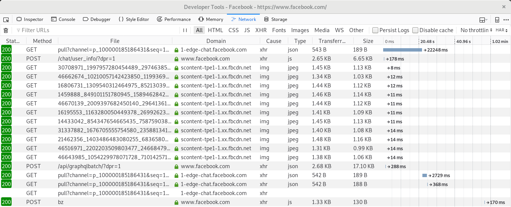
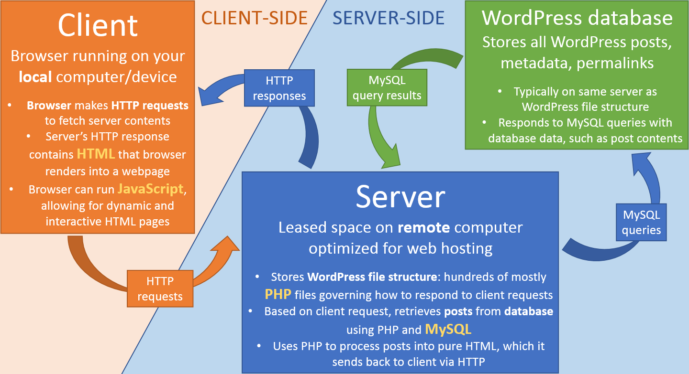
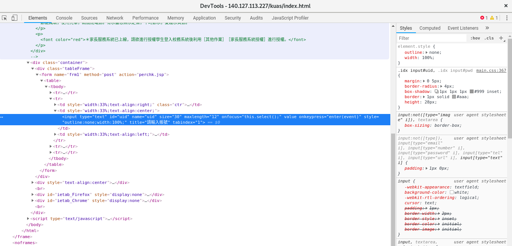
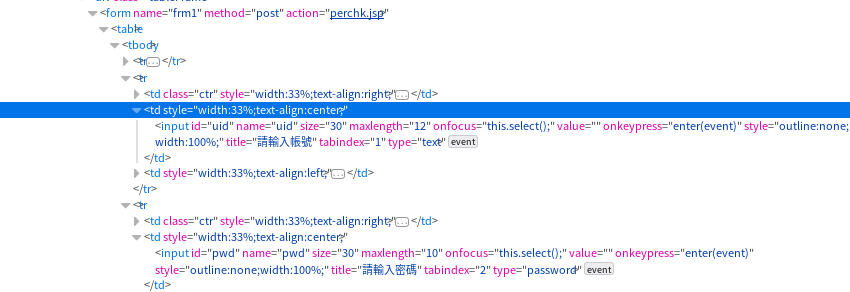
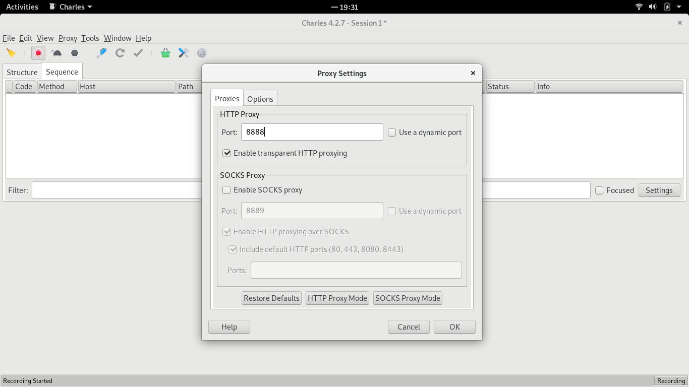
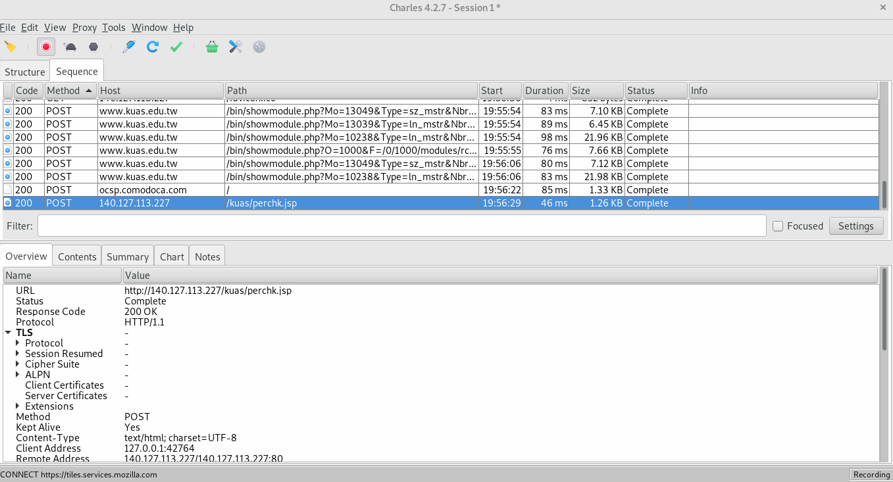
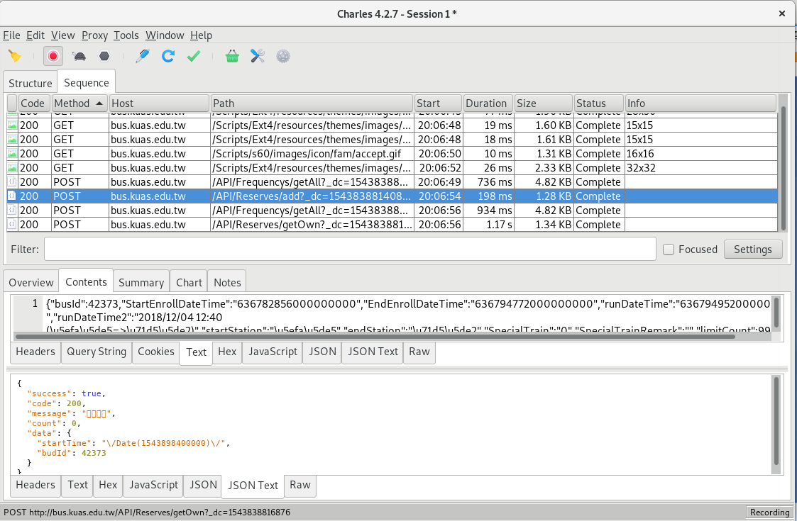
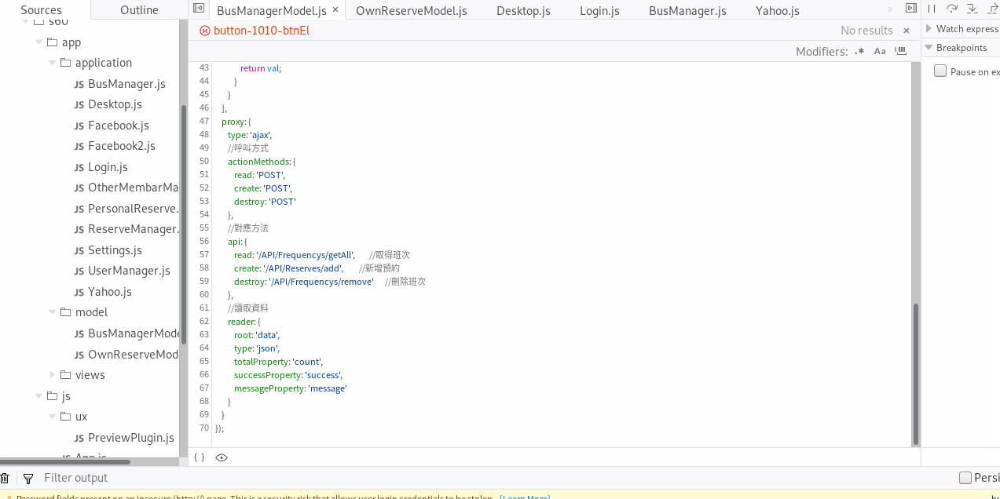
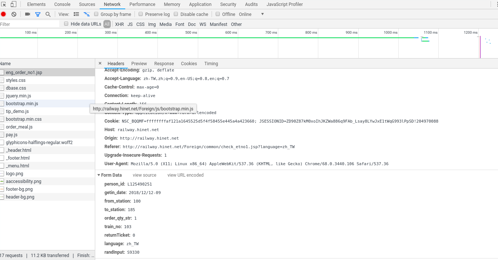

title:  那些瀏覽器背後的事
output: index.html
progress: true

--
# 那些瀏覽器背後的事
## lemotw
--
### 你聽到主題是以為我要講的

--
### 我真正要講的主題

--
# 你想過網站是怎麼運作?
--

--
# Javascript & ajax 
--
# Restful
--
# Micro Service
--
# 讓我們藉由F12看看網站長怎樣
--
### 以<a href="http://140.127.113.227/kuas/index.html">校務系統</a>為例

--
# Login by Python
--
# Python package <a href="http://docs.python-requests.org/en/master/">requests</a>
--
### Before you send request

--
### 然後送一個 post request

### req = s.post('http://140.127.113.227/kuas/perchk.jsp',data={'uid':uid,'pwd':setPwd(str(pwd))})
--
# 看HTML好像很沒有效率
--
# 沒關係，那我們把封包截下來ㄅ
--
# <a href="https://www.charlesproxy.com/">Charles</a>
--
### 設定好Proxy的port，在設定電腦得Proxy

--
### Request紀錄

--
# 使用功能需要的參數
--
### 用Charles你可以看到

--
# 讓我們追看看這些參數的來源吧~
--
### 如果你發時間去追code的話可以找到這邊

--
# 恩亨，相信聰明如你們應該有辦法在用Python去模擬訂校車了
--
### 那我覺得這個你們可以解決這個了

--
# 更多資源盡在資研社~
---
# Any Question?

   

  

<h2 style="font-size: 18px">
本投影片採用<a href="http://creativecommons.org/licenses/by-sa/3.0/tw/" target="_blank">創用 CC「姓名標示—相同方式分享 3.0 台灣」授權條款</a>
</h2>
