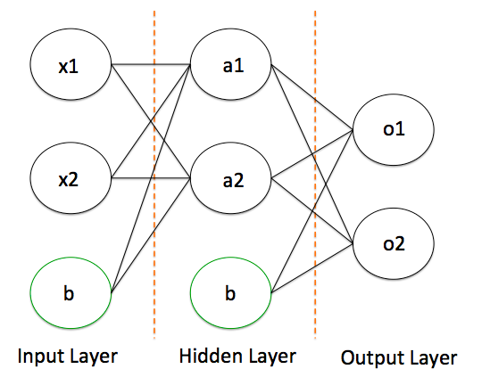

title: 深入淺出Neural Network
output: index.html
progress: true

--
# 深入淺出Neural Network
## lemotw
--
# 為什麼要神經網路
--
# 我們先來講講他的歷史脈落ㄅ
--
### 看看那宏偉的歷史
* 1940 ~ <a href="https://blog.birkhoff.me/the-hebbs-rule/">Hebb's rule</a>
* 1975 ~ <a href="https://zh.wikipedia.org/wiki/%E5%8F%8D%E5%90%91%E4%BC%A0%E6%92%AD%E7%AE%97%E6%B3%95">Backpropagation</a>
* Perceptron
* Deep Learning
--
# <a href="https://medium.com/@yehjames/%E8%B3%87%E6%96%99%E5%88%86%E6%9E%90-%E6%A9%9F%E5%99%A8%E5%AD%B8%E7%BF%92-%E7%AC%AC3-2%E8%AC%9B-%E7%B7%9A%E6%80%A7%E5%88%86%E9%A1%9E-%E6%84%9F%E7%9F%A5%E5%99%A8-perceptron-%E4%BB%8B%E7%B4%B9-84d8b809f866">Perceptron</a>
--
# 那麼多層神經網路是怎麼運作的呢?
--
### 我們看看它長什麼樣子吧~

--
# 那麼它是如何能學習的呢?
--
# <a href="https://drive.google.com/open?id=11Aas3DsbVNo2Kb-EqMS79XtSZy4HBMUClNH2V1Lb6IQ">容許我偷懶</a>

---

# Any Question?

   

  

<h2 style="font-size: 18px">
本投影片採用<a href="http://creativecommons.org/licenses/by-sa/3.0/tw/" target="_blank">創用 CC「姓名標示—相同方式分享 3.0 台灣」授權條款</a>
</h2>
